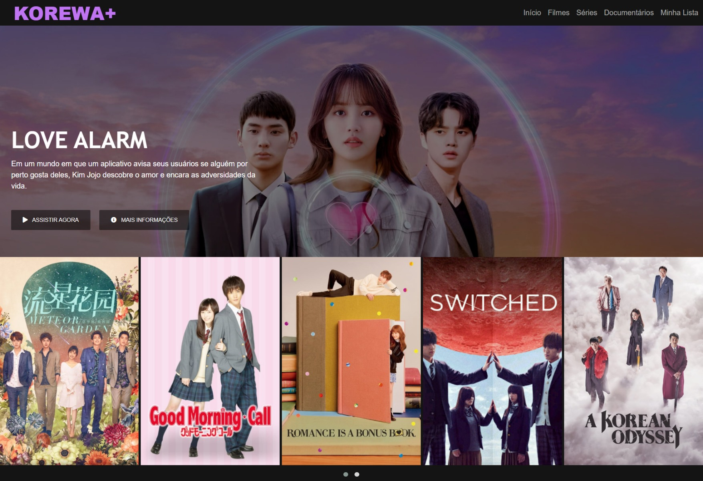

# Interface da Netflix | 

(Re)criando a interface da Netflix utilizando as tecnologias: HTML5, CSS3 e JavaScript. Projeto de estudo para aprender como estruturar um layout, técnicas de CSS3 com containers e variáveis, como posicionar os elementos com Flexbox e como utilizar plugins JQuery.

### Tecnologias e ferramentas utilizadas:

    
    
    

 

## Resultado | Korewa+

  <kbd>
    
  </kbd>

